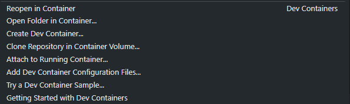

# Barathon Professional

<div align="center">

[](https://sonarcloud.io/summary/new_code?id=Barathon-2i-Tech_Barathon_Pro) [](https://sonarcloud.io/summary/new_code?id=Barathon-2i-Tech_Barathon_Pro) [](https://sonarcloud.io/summary/new_code?id=Barathon-2i-Tech_Barathon_Pro) [](https://sonarcloud.io/summary/new_code?id=Barathon-2i-Tech_Barathon_Pro) [](https://sonarcloud.io/summary/new_code?id=Barathon-2i-Tech_Barathon_Pro)

</div>

## Prerequisites

You need Visual Studio Code and Docker installed.

## .env

You need copy first the .env.example file by renaming it to .env and complete the following fields:

- VITE_API_URL

```bash
cp .env.example .env
```

## Start Docker

Run the Docker Desktop application to start Docker. You will know it's running if you look in the activity tray and see the Docker whale icon.
Docker might take a few minutes to start. If the whale icon is animated, it is probably still in the process of starting. You can click on the icon to see the status.

<div align="center">

</div>

## Check Docker

Once Docker is running, you can confirm that everything is working by opening a new terminal window and typing the command:

```bash
docker --version
# Docker version 18.09.2, build 6247962
```

## Install the extension

The Dev Containers extension lets you run Visual Studio Code inside a Docker container.

<div align="center">

</div>

When the Dev Containers extension is installed, you will see a new Status bar item at the far left.

<div align="center">

</div>

## Open the application into the devcontainer

Click on the status bar and choose "Reopen in container".

<div align="center">



</div>

Visual Studio will reload and you will see Dev Container written next to the status bar.

<div align="center">


</div>

The application is now launched in a container. Just type "**_npm run dev_**" in the terminal